# Phase 4: Design & Architecture

**Status:** 🚧 IN PROGRESS  
**Created:** 2025-01-04  
**Last Updated:** 2025-01-04

---

## Overview

This document provides comprehensive system design, architecture, security, reliability, and AI component definitions for Content Studio. It includes system flows, technical specifications, API designs, and AI prompt structures.

---

## 4.1 System Design

### 4.1.1 Architectural Pattern Selection and Approval

#### Clarification Phase

**Question 1: Architectural Pattern Needs**

Before proceeding with detailed system design, we need to understand your architectural preferences and requirements:

**Questions:**
1. **Project Complexity:** Content Studio involves multiple AI integrations, async processing, and microservice communication. Do you prefer a layered architecture (simple) or a more sophisticated pattern like Onion Architecture or Clean Architecture?

2. **Team Size:** How many developers will work on this? (This affects pattern complexity choice)

3. **Maintenance Priority:** Is code maintainability and testability more important than initial development speed?

4. **Testing Requirements:** Do you need strict separation of concerns for comprehensive testing? (This favors Clean/Onion Architecture)

5. **Scalability Needs:** Will Content Studio need to scale horizontally? (This affects service boundaries)

6. **Existing Patterns:** Are there any architectural patterns already established in other Educore AI microservices that Content Studio should follow?

**Proposed Architectural Patterns for Consideration:**

**Option 1: Onion Architecture (Clean Architecture)**
- **Best For:** High maintainability, testability, strict separation of concerns
- **Structure:** Domain → Application → Infrastructure → Presentation
- **Benefits:** Independent of frameworks, databases, and external concerns
- **Complexity:** Medium-High
- **Suitability for Content Studio:** ⭐⭐⭐⭐⭐ (Excellent for AI integration, external APIs)

**Option 2: Layered Architecture (Traditional)**
- **Best For:** Simple projects, fast development
- **Structure:** Presentation → Business → Data Access
- **Benefits:** Simple, easy to understand
- **Complexity:** Low
- **Suitability for Content Studio:** ⭐⭐⭐ (Good, but less flexible for AI integrations)

**Option 3: Hexagonal Architecture (Ports & Adapters)**
- **Best For:** Heavy external integrations
- **Structure:** Core → Adapters (Primary/Secondary)
- **Benefits:** Isolates core logic from external systems
- **Complexity:** Medium
- **Suitability for Content Studio:** ⭐⭐⭐⭐ (Good for multiple AI APIs)

**Recommendation:** Based on Content Studio's requirements (multiple AI APIs, async processing, microservice integration, quality requirements), I recommend **Onion Architecture (Clean Architecture)** for:
- Strict separation of AI logic from business logic
- Easy testing of AI integrations
- Maintainable code structure
- Flexible for future AI provider additions

**Awaiting your response to proceed with pattern selection.**

---

### ✅ Architectural Pattern Approved: Onion Architecture (Clean Architecture)

**Approval Date:** 2025-01-04  
**Approved Pattern:** Onion Architecture (Clean Architecture)

**Rationale:**
- **Multiple AI Integrations:** Requires strict separation of AI logic from business logic
- **Async Processing:** Clean boundaries enable queue-based processing
- **Microservice Integration:** Adapter pattern fits well in Onion Architecture
- **Testability:** High testability requirements favor Clean Architecture
- **Maintainability:** Future AI provider additions require flexible structure

**Onion Architecture Structure:**

```
┌─────────────────────────────────────────┐
│      Presentation Layer (Frontend)      │
│  - React Components                     │
│  - UI/UX Logic                          │
└─────────────────────────────────────────┘
                    ↓
┌─────────────────────────────────────────┐
│      Application Layer (Backend API)    │
│  - REST Controllers                     │
│  - Request/Response DTOs                │
│  - API Routes                            │
└─────────────────────────────────────────┘
                    ↓
┌─────────────────────────────────────────┐
│      Domain Layer (Business Logic)      │
│  - Entities (Course, Topic, Content)    │
│  - Domain Services                      │
│  - Business Rules                       │
│  - Use Cases                            │
└─────────────────────────────────────────┘
                    ↓
┌─────────────────────────────────────────┐
│   Infrastructure Layer (External)       │
│  - Database (Repository Implementation) │
│  - AI APIs (OpenAI, Gemini, etc.)       │
│  - Microservices (gRPC/REST Clients)    │
│  - Queue System (Redis/BullMQ)          │
│  - Storage (Supabase Storage)           │
└─────────────────────────────────────────┘
```

**Layer Responsibilities:**

1. **Domain Layer (Core):**
   - Entities: Course, Topic, Content, Template
   - Value Objects: ContentType, GenerationMethod, Status
   - Domain Services: ContentGenerationService, QualityCheckService
   - Repository Interfaces (not implementations)
   - Business Rules and Validation

2. **Application Layer:**
   - Use Cases: CreateCourseUseCase, GenerateContentUseCase, etc.
   - Application Services: Orchestrates domain services
   - DTOs: Request/Response data transfer objects
   - Application-specific validation

3. **Infrastructure Layer:**
   - Repository Implementations: Database access
   - External API Clients: OpenAI, Gemini, Google Slides
   - Microservice Clients: gRPC/REST clients
   - Queue Workers: Background job processors
   - Storage Adapters: Supabase Storage

4. **Presentation Layer:**
   - React Components
   - UI State Management
   - API Client (HTTP requests)
   - User Interaction Logic

**Benefits for Content Studio:**
- ✅ Independent of AI providers (easy to swap OpenAI/Gemini)
- ✅ Testable: Domain logic testable without external dependencies
- ✅ Flexible: New AI providers can be added without changing core logic
- ✅ Maintainable: Clear separation of concerns
- ✅ Scalable: Infrastructure layer can be swapped (different queue, storage)

---

### 4.1.2 Service Boundaries Definition

**Monolith vs. Microservices Decision:**

**Decision: Monolith Backend with Microservice Integration**

**Rationale:**
- Content Studio is a single microservice in Educore AI ecosystem
- Internal operations are cohesive (content creation and management)
- No need to split into multiple services
- Easier development and deployment for MVP
- Single database for all Content Studio operations

**Service Boundaries:**

**Content Studio Internal (Monolith):**
- Course Management
- Lesson/Topic Management
- Content Creation (all methods)
- Template Management
- Content Versioning
- Quality Checks
- Search & Filtering
- Notifications

**External Services (Microservices):**
- **Directory Service:** Trainer validation, permissions
- **Skills Engine:** Skills mapping
- **Course Builder:** Course structure exchange
- **DevLab:** Exercise generation
- **Learning Analytics:** Usage statistics
- **RAG:** Content indexing

**External APIs:**
- **OpenAI:** GPT-4o-mini, Whisper
- **Gemini:** Mind map generation
- **Google Slides:** Presentation generation
- **Supabase:** Storage and database

**Inter-Service Communication Patterns:**

1. **Synchronous (Request-Response):**
   - gRPC: Course Builder, Skills Engine, Directory, DevLab
   - REST: RAG, Learning Analytics
   - Direct API calls for immediate responses

2. **Asynchronous (Queue-Based):**
   - Video transcription (Whisper)
   - Format generation (AI APIs)
   - Quality checks
   - Notification delivery

3. **Event-Driven (Future Enhancement):**
   - Content approval events
   - Course publication events
   - Integration with event bus (future)

**Data Ownership and Consistency:**

- **Content Studio:** Owns courses, topics, content, templates
- **Directory:** Owns trainer information, permissions
- **Skills Engine:** Owns skills mapping data
- **Course Builder:** Owns course assembly and learner customization
- **DevLab:** Owns exercise generation and validation

**Consistency Models:**
- **Strong Consistency:** Within Content Studio (ACID transactions)
- **Eventual Consistency:** With external microservices (async updates)
- **Compensation:** Rollback mechanisms for failed integrations

---

### 4.1.3 Data Flow and Interfaces

**Data Flow Diagrams:**

**1. Content Creation Flow (Video-to-Lesson):**

```
Trainer → Frontend (Upload Video)
    ↓
Backend API (POST /api/videos/upload)
    ↓
Supabase Storage (Store Video)
    ↓
Queue System (Add Transcription Job)
    ↓
Worker Process:
    ├─→ Whisper API (Transcribe)
    ├─→ GPT-4o-mini (Summarize)
    └─→ Format Generators (Parallel):
        ├─→ Text Generator
        ├─→ Code Generator
        ├─→ Presentation Generator
        ├─→ Audio Generator
        └─→ Mind Map Generator
    ↓
Database (Save Content)
    ↓
Notification System (Notify Completion)
    ↓
Frontend (Display Results)
```

**2. AI-Assisted Content Creation Flow:**

```
Trainer → Frontend (Input Topic + Key Ideas)
    ↓
Backend API (POST /api/content/ai-generate)
    ↓
Application Layer:
    ├─→ Load Prompt Template
    ├─→ Merge with Trainer Input
    └─→ Select Format Generators
    ↓
Format Generator Service:
    ├─→ OpenAI GPT-4o-mini (Text)
    ├─→ Gemini API (Mind Map)
    └─→ Google Slides API (Presentation)
    ↓
Database (Save Generated Content)
    ↓
Frontend (Display Preview)
```

**3. Course Creation Flow:**

```
Trainer → Frontend (Create Course Form)
    ↓
Backend API (POST /api/courses)
    ↓
Application Layer:
    ├─→ Validate Input
    ├─→ Create Course Entity
    └─→ Save to Database
    ↓
Integration Layer:
    └─→ Directory Service (Update Trainer Courses)
    ↓
Database (Save Course)
    ↓
Frontend (Display Course)
```

**API Design:**

**REST API Endpoints:**

**Courses:**
- `POST /api/courses` - Create course
- `GET /api/courses` - List courses (with filters)
- `GET /api/courses/:id` - Get course
- `PUT /api/courses/:id` - Update course
- `DELETE /api/courses/:id` - Soft delete course

**Topics/Lessons:**
- `POST /api/topics` - Create topic/lesson
- `GET /api/topics` - List topics (with filters)
- `GET /api/topics/:id` - Get topic
- `PUT /api/topics/:id` - Update topic
- `DELETE /api/topics/:id` - Soft delete topic

**Content:**
- `POST /api/content` - Create content item
- `GET /api/content/:id` - Get content
- `PUT /api/content/:id` - Update content
- `DELETE /api/content/:id` - Soft delete content
- `POST /api/content/:id/regenerate` - Regenerate content
- `GET /api/content/:id/history` - Get version history
- `POST /api/content/:id/restore` - Restore version

**Templates:**
- `POST /api/templates` - Create template
- `GET /api/templates` - List templates
- `GET /api/templates/:id` - Get template
- `PUT /api/templates/:id` - Update template
- `DELETE /api/templates/:id` - Delete template
- `POST /api/templates/:id/apply` - Apply template to lesson

**Video Upload:**
- `POST /api/videos/upload` - Upload video
- `GET /api/videos/:id/status` - Get processing status
- `GET /api/videos/:id/result` - Get generated lesson

**AI Generation:**
- `POST /api/content/ai-generate` - Generate content with AI
- `GET /api/content/:id/generation-status` - Get generation status

**Quality Checks:**
- `POST /api/content/:id/quality-check` - Trigger quality check
- `GET /api/content/:id/quality-check` - Get quality check results

**Search:**
- `GET /api/search` - Search content (query params: q, status, generation_method, format_type, page, limit)

**Notifications:**
- `GET /api/notifications` - List notifications
- `PUT /api/notifications/:id/read` - Mark as read
- `DELETE /api/notifications` - Clear all

**Database Design:**

**Entity Relationships:**
- `trainer_courses` (1) → (N) `topics`
- `topics` (N) → (1) `trainer_courses` (optional, nullable)
- `topics` (1) → (N) `content`
- `topics` (N) → (1) `templates` (optional)
- `content` (1) → (N) `content_history`
- `content` (N) → (1) `content_types` (enum reference)
- `content` (N) → (1) `generation_methods` (enum reference)

**Integration Patterns:**

**gRPC Service Definitions:**

**Course Builder Service:**
```protobuf
service CourseBuilderService {
  rpc SendCourse(CourseRequest) returns (CourseResponse);
  rpc RequestPersonalizedCourse(LearnerRequest) returns (CoursePackage);
}
```

**Skills Engine Service:**
```protobuf
service SkillsEngineService {
  rpc GetSkills(SkillsRequest) returns (SkillsResponse);
}
```

**Directory Service:**
```protobuf
service DirectoryService {
  rpc ValidateTrainer(TrainerRequest) returns (TrainerInfo);
  rpc UpdateCourses(CourseUpdateRequest) returns (UpdateResponse);
}
```

**DevLab Service:**
```protobuf
service DevLabService {
  rpc GenerateExercises(ExerciseRequest) returns (ExerciseResponse);
  rpc ValidateQuestion(QuestionRequest) returns (ValidationResponse);
}
```

**REST API Contracts:**

**RAG Service:**
- `POST /api/rag/index` - Index content
- `GET /api/rag/search` - Search content

**Learning Analytics Service:**
- `POST /api/analytics/stats` - Send usage statistics
- `GET /api/analytics/insights` - Get insights

---

### 4.1.4 System Flow Documentation

**General System Flow:**

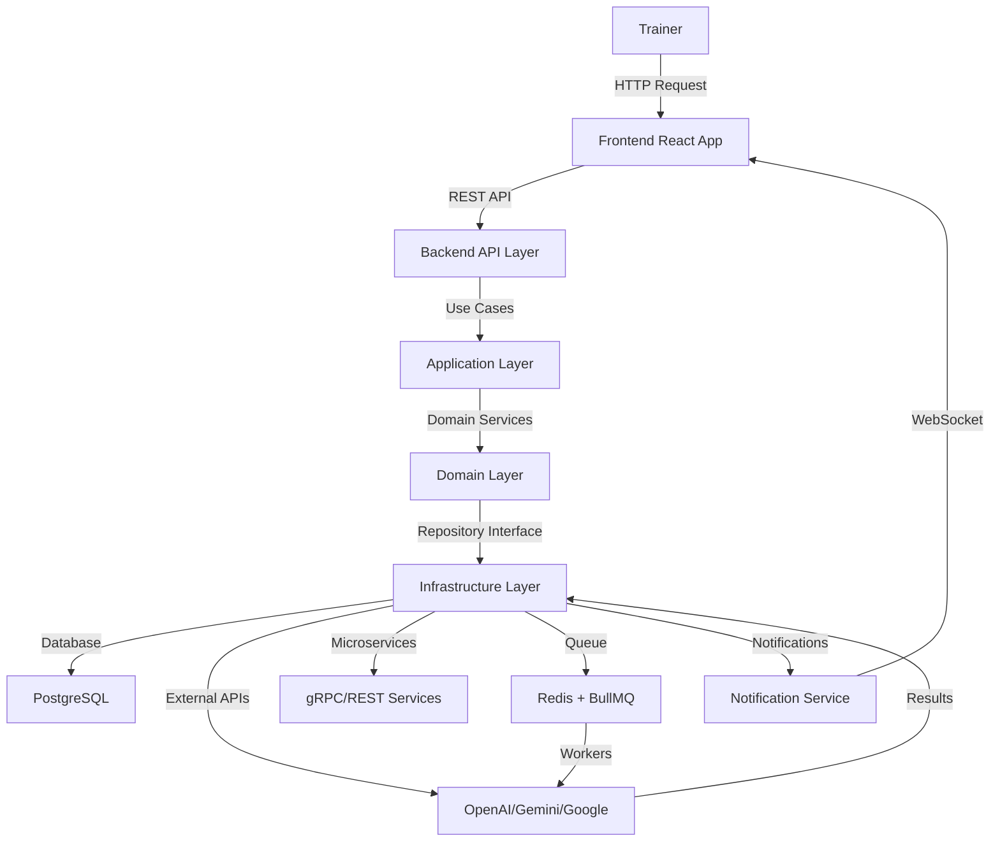

**Feature-Specific Flows:**

---

## Feature: A1. Video-to-Lesson Transformation

### User Journey Flow

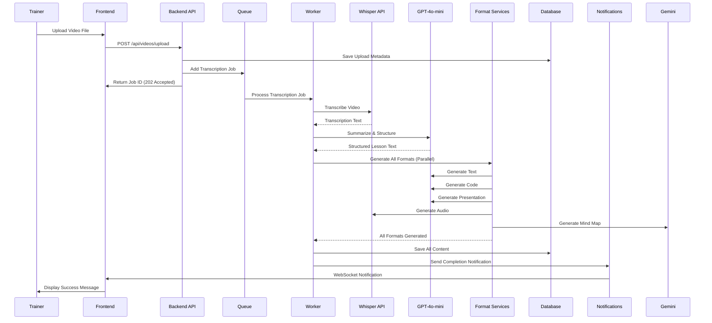

### System Interaction Flow

**Components:**
1. **VideoUploadService** - Handles file upload
2. **TranscriptionService** - Orchestrates Whisper API
3. **SummarizationService** - Orchestrates GPT-4o-mini
4. **FormatGenerationOrchestrator** - Coordinates format generation
5. **FormatGeneratorFactory** - Creates appropriate generators
6. **ContentRepository** - Saves content to database
7. **NotificationService** - Sends notifications

### Data Flow Architecture

**Input:** Video file (MP4, MOV, AVI, WebM, max 500MB)

**Processing Pipeline:**
1. Upload → Supabase Storage
2. Transcription → Whisper API → Text
3. Summarization → GPT-4o-mini → Structured Text
4. Format Generation (Parallel):
   - Text → GPT-4o-mini → content_data JSONB
   - Code → GPT-4o-mini → content_data JSONB
   - Presentation → GPT-4o-mini → Google Slides API → URL
   - Audio → Whisper TTS → Supabase Storage → URL
   - Mind Map → Gemini API → Mermaid JSON → content_data JSONB

**Output:**
- Topic record in `topics` table
- 5 content records in `content` table (one per format)
- All content_data stored in JSONB format
- External file URLs stored in content_url field

### State Transitions

**Video Processing States:**
```
uploaded → queued → transcribing → summarizing → generating → completed → saved
                ↓           ↓            ↓            ↓
              failed → retry → (back to previous state)
```

**Format Generation States (per format):**
```
pending → generating → completed → saved
    ↓         ↓           ↓
  failed → retry → (back to generating)
```

### Error Handling Flows

**Error Scenarios:**
1. **Upload Failure:** Return error, allow retry
2. **Transcription Failure:** Retry up to 3 times, then notify user
3. **Summarization Failure:** Retry with fallback prompt
4. **Format Generation Failure:** Continue with successful formats, notify partial completion
5. **Database Save Failure:** Retry, maintain queue job for recovery

**Recovery Mechanisms:**
- Queue job retry with exponential backoff
- Partial completion handling (save what succeeded)
- User notification with error details
- Manual retry option for failed formats

---

## Feature: A2. AI-Assisted Content Creation

### User Journey Flow

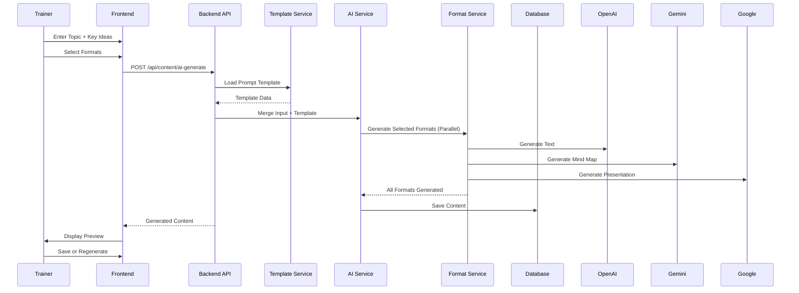

### System Interaction Flow

**Components:**
1. **AIGenerationService** - Orchestrates AI generation
2. **PromptTemplateService** - Manages prompt templates
3. **FormatGeneratorFactory** - Creates format generators
4. **ContentRepository** - Saves content

### Data Flow Architecture

**Input:**
- Topic (3-200 characters)
- Key ideas (10-2000 characters)
- Selected formats (array)

**Processing:**
1. Load prompt template from database
2. Merge trainer input with template variables
3. For each selected format:
   - Create format generator
   - Call appropriate AI API
   - Parse response
   - Store in content_data JSONB

**Output:**
- Content records in `content` table
- generation_method = 'ai_assisted'
- content_data contains generated content

---

## Feature: B1. Course Management

### User Journey Flow

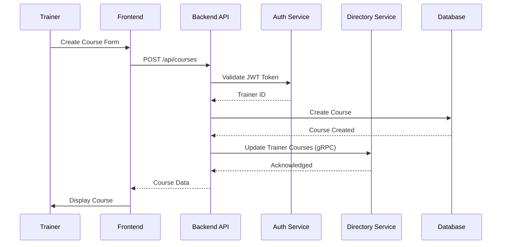

### System Interaction Flow

**CRUD Operations:**
- Create: Validate → Save → Notify Directory
- Read: Query database → Return
- Update: Validate → Update → Notify Directory
- Delete: Soft delete → Update status → Notify Directory

### Data Flow Architecture

**Create Course:**
- Input: course_name, description, skills[], language, company_logo
- Validation: Check trainer permissions, validate input
- Storage: Save to trainer_courses table
- Integration: Notify Directory service
- Output: Course object with course_id

---

## Feature: B2. Lesson/Topic Management

### User Journey Flow

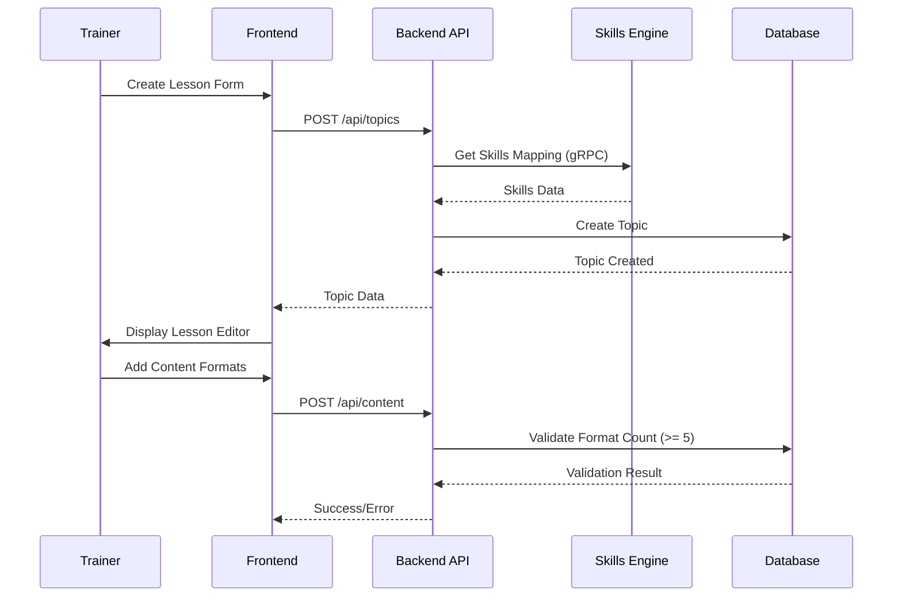

### System Interaction Flow

**Format Requirement Validation:**
- Check total_content_formats >= 5
- Validate mandatory formats present (text, code, presentation, audio, mind_map)
- Update format flags (has_text, has_code, etc.)
- Update content counts

---

## Feature: C1. Quality & Originality Checks

### User Journey Flow

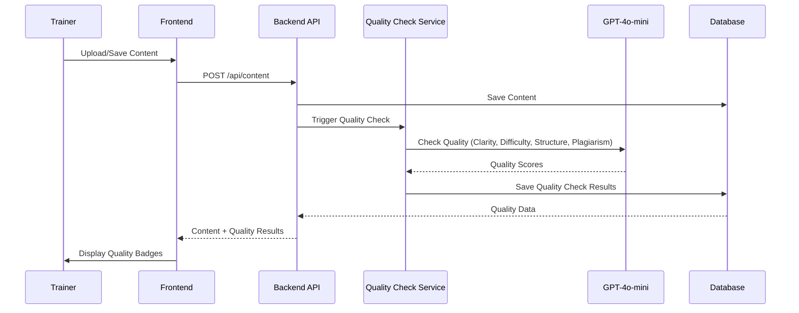

### System Interaction Flow

**Quality Check Process:**
1. Content saved → Trigger quality check
2. GPT-4o-mini analyzes:
   - Clarity (0-100)
   - Difficulty level (0-100)
   - Logical structure (0-100)
   - Plagiarism similarity (0-100)
3. Store results in quality_check_data JSONB
4. Set quality_check_status (pending/passed/failed/flagged)
5. Return results to frontend

---

## Feature: D1. Microservice Integration

### Integration Flow Examples

**Course Builder Integration (Trainer-Customized Course):**

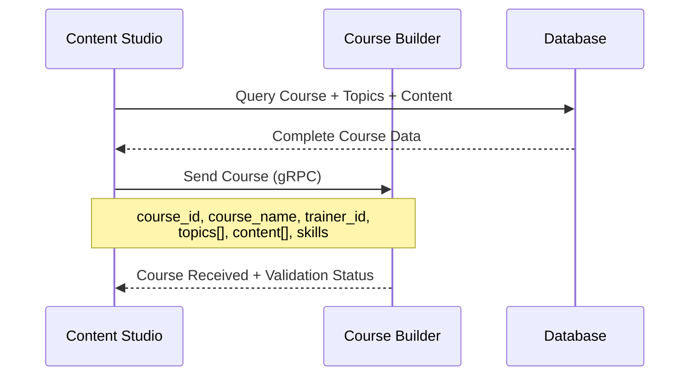

**Skills Engine Integration:**

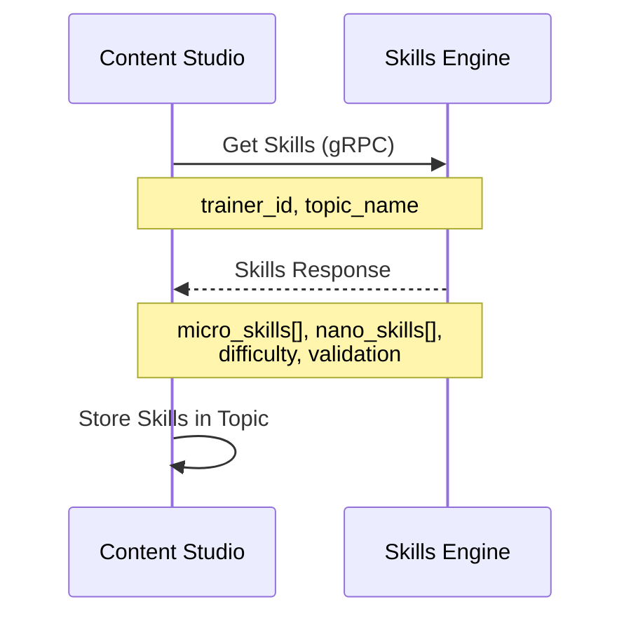

---

### Technical Specifications Documentation

**System-Wide Technical Constraints:**

**Performance Targets:**
- Page load: < 2 seconds
- API response: < 500ms (standard queries)
- Database queries: < 100ms (with indexes)
- Video processing: < 5 minutes for 10-minute video

**Security Specifications:**

**Authentication:**
- JWT token validation via Authentication microservice
- Token expiration: 24 hours
- Refresh token mechanism

**Authorization:**
- Trainer permissions validated via Directory service
- Role-based access: Single trainer ownership per course/lesson
- API-level authorization checks

**Data Encryption:**
- At rest: Database encryption (Supabase managed)
- In transit: HTTPS/TLS for all communications
- API keys: Environment variables only

**Reliability Specifications:**

**Uptime Targets:**
- API availability: 99.9%
- Database availability: 99.9%
- External API resilience: Circuit breaker pattern

**Fault Tolerance:**
- Retry logic for transient failures
- Graceful degradation (partial format generation)
- Queue job persistence (Redis)
- Database connection pooling

**Backup Strategies:**
- Database: Automated backups (Supabase managed)
- Storage: Supabase Storage replication
- Code: Git repository with version control

**Data Retention:**
- Active content: Indefinite
- Archived content: 7 years
- Deleted content: Never physically deleted (soft delete)

**Integration Specifications:**

**API Contracts:**
- REST APIs: OpenAPI/Swagger documentation
- gRPC: Protocol Buffers definitions
- Request/Response formats: JSON
- Error responses: Standardized error format

**Data Format Standards:**
- Date format: ISO 8601
- Language codes: ISO 639-1
- Content types: Enum values
- Generation methods: Enum values

**Webhook Specifications:**
- Content approval webhooks (future)
- Course publication webhooks (future)

**Deployment Specifications:**

**Environment Specifications:**
- Development: Local + Docker
- Staging: Railway (backend), Vercel (frontend)
- Production: Railway (backend), Vercel (frontend)

**Deployment Procedures:**
- CI/CD: GitHub Actions
- Automated testing before deployment
- Database migrations via Supabase CLI
- Feature flags for gradual rollout

**Rollout Strategy:**
- Beta testing with select trainers
- Gradual rollout (10% → 50% → 100%)
- Monitoring and rollback capability

**Compliance Specifications:**

**Privacy Regulations:**
- GDPR: Right to access, soft delete (data preserved)
- CCPA: Data transparency, soft delete
- Data retention: Audit trail maintained

**Industry Standards:**
- WCAG 2.1 AA for accessibility
- OWASP Top 10 security practices
- REST API best practices

**Testing Specifications:**

**Test Coverage Targets:**
- Unit tests: 80%+ coverage
- Integration tests: All API endpoints
- E2E tests: Critical user flows
- Performance tests: Load testing (100 concurrent users)

**Performance Benchmarks:**
- Page load: < 2 seconds
- API response: < 500ms
- Database queries: < 100ms

**Security Test Criteria:**
- SQL injection prevention
- XSS prevention
- CSRF protection
- Authentication/authorization testing

**Load Testing Requirements:**
- 100 concurrent users
- 1000 courses
- 10000 lessons
- 50000 content items

**Monitoring Specifications:**

**Metrics to Track:**
- API response times
- Error rates
- Queue job processing times
- External API call success rates
- Database query performance
- User engagement metrics

**Logging Requirements:**
- All API calls logged with trainer ID
- Error logging with stack traces
- Performance logging for slow operations
- Security event logging

**Alerting Thresholds:**
- API error rate > 5%
- Response time > 1 second
- Queue job failure rate > 10%
- Database connection pool exhaustion

---

## 4.2 Security Foundation

### Authentication and Authorization Model

**Authentication Strategy:**
- **Method:** JWT token validation
- **Provider:** Authentication microservice (external)
- **Token Flow:**
  1. Trainer logs in via Authentication microservice
  2. Receives JWT token
  3. Frontend sends token in Authorization header
  4. Content Studio validates token with Authentication microservice
  5. Extracts trainer_id from token

**Authorization Model:**
- **Provider:** Directory microservice
- **Validation Flow:**
  1. Content Studio sends trainer_id to Directory service
  2. Directory returns trainer permissions and organization info
  3. Content Studio enforces permissions:
     - Trainer can only access their own courses/lessons
     - Single trainer ownership (no collaboration in MVP)

**Role-Based Access Control (RBAC):**
- **Roles:** Trainer (single role in MVP)
- **Permissions:**
  - Create, edit, delete own courses/lessons
  - Generate content
  - View own content
  - No access to other trainers' content

**API Security:**
- **Rate Limiting:** 100 requests/minute per trainer
- **Input Validation:** All inputs validated and sanitized
- **SQL Injection Prevention:** Parameterized queries only
- **XSS Prevention:** React built-in protections + input sanitization

**Session Management:**
- Stateless authentication (JWT)
- Token refresh mechanism
- Session timeout: 24 hours

### Data Protection Strategy

**Data Encryption:**
- **At Rest:** Database encryption (Supabase managed)
- **In Transit:** HTTPS/TLS for all communications
- **API Keys:** Stored in environment variables, never in code

**Data Privacy:**
- **User Data:** Minimal collection (trainer_id only)
- **Content Data:** Owned by trainer, encrypted in database
- **Audit Trail:** Complete history in content_history table

**Backup and Recovery:**
- **Database Backups:** Automated daily backups (Supabase)
- **Storage Backups:** Supabase Storage replication
- **Recovery Procedures:** Documented rollback procedures

**Data Retention and Deletion:**
- **Active Content:** Indefinite retention
- **Archived Content:** 7 years retention
- **Deleted Content:** Soft delete only (status = 'deleted')
- **Audit Trail:** Permanent retention in content_history

---

## 4.3 AI Component Definition

### Model and Prompt Structure

**AI Models Used:**

1. **OpenAI GPT-4o-mini:**
   - **Purpose:** Text generation, summarization, quality checks
   - **Usage:** Text, code, presentation generation, quality validation
   - **Configuration:** Temperature 0.7, Max tokens 4000

2. **OpenAI Whisper:**
   - **Purpose:** Video transcription, audio generation
   - **Usage:** Video-to-lesson transcription, TTS
   - **Configuration:** Model: whisper-1, Language: auto-detect

3. **Gemini API:**
   - **Purpose:** Mind map generation
   - **Usage:** Concept extraction, relationship mapping
   - **Configuration:** Model: gemini-pro

4. **Google Slides API:**
   - **Purpose:** Presentation generation
   - **Usage:** Slide creation from text content
   - **Configuration:** OAuth 2.0 authentication

**Prompt Template Structure:**

**Base Prompt Template:**
```
You are an educational content creator. Generate [CONTENT_TYPE] content for a lesson about [TOPIC].

Key Points to Cover:
[KEY_IDEAS]

Style: [STYLE_MODE]
Target Audience: [AUDIENCE]
Difficulty Level: [DIFFICULTY]

Requirements:
- Minimum [MIN_WORDS] words
- Clear and engaging
- Educational and accurate
- Well-structured

Generate the content:
```

**Prompt Variables:**
- `[CONTENT_TYPE]`: text, code, presentation, etc.
- `[TOPIC]`: Lesson topic
- `[KEY_IDEAS]`: Trainer-provided key ideas
- `[STYLE_MODE]`: formal, conversational, educational
- `[AUDIENCE]`: Learner level
- `[DIFFICULTY]`: Beginner, intermediate, advanced
- `[MIN_WORDS]`: Minimum word count

**Prompt Versioning:**
- Prompts stored in templates table
- Version control for prompt changes
- A/B testing capability (future)

### Dataset Provenance Tagging

**Provenance Tracking:**
- **Source:** Internal (user-generated), External (AI-generated)
- **Generation Method:** video_to_lesson, ai_assisted, manual
- **AI Provider:** openai, gemini, google_slides
- **Model Version:** gpt-4o-mini, whisper-1, gemini-pro
- **Prompt Version:** Template ID and version
- **Timestamp:** Generation timestamp

**Storage in Database:**
- `content.generation_method_id` - How content was created
- `content.ai_provider` - Which AI provider used
- `content.ai_model` - Which model version
- `content.prompt_template_id` - Prompt template used
- `content.raw_ai_response` - Raw AI response (JSONB)
- `content.created_at` - Generation timestamp

**Bias Detection and Mitigation:**
- Quality checks include bias detection
- Prompt templates reviewed for bias
- Diverse training data considerations (future)

**AI Explainability:**
- Store raw AI responses for transparency
- Prompt templates visible to trainers
- Generation method clearly indicated

---

## 4.4 Reliability / Errors / Security

### Reliability Design

**Fault Tolerance:**
- **Circuit Breaker Pattern:** For external API calls
  - Open state after 5 consecutive failures
  - Half-open state after 30 seconds
  - Closed state when healthy

- **Retry Logic:**
  - Exponential backoff: 1s, 2s, 4s, 8s, 16s
  - Max retries: 3 attempts
  - Retryable errors: Network timeouts, 5xx errors

- **Graceful Degradation:**
  - Partial format generation (if some formats fail)
  - Fallback to manual creation if AI fails
  - Cached responses for lookup data

**Error Handling:**
- **Error Categories:**
  - Validation errors (400)
  - Authentication errors (401)
  - Authorization errors (403)
  - Not found errors (404)
  - Server errors (500)
  - External API errors (502, 503)

- **Error Response Format:**
```json
{
  "error": {
    "code": "ERROR_CODE",
    "message": "User-friendly error message",
    "details": "Technical details (development only)",
    "timestamp": "2025-01-04T12:00:00Z",
    "request_id": "unique-request-id"
  }
}
```

**Recovery Mechanisms:**
- **Queue Job Recovery:**
  - Failed jobs stored in Redis
  - Manual retry capability
  - Dead letter queue for permanent failures

- **Database Recovery:**
  - Transaction rollback on errors
  - Connection retry with exponential backoff
  - Connection pool management

- **External API Recovery:**
  - Circuit breaker prevents cascading failures
  - Fallback to alternative providers (future)
  - Cached responses when available

**Monitoring and Alerting:**
- **Health Checks:**
  - `/health` endpoint for liveness
  - `/health/ready` endpoint for readiness
  - Database connectivity check
  - External API health check

- **Alerting:**
  - Error rate > 5%
  - Response time > 1 second
  - Queue job failure rate > 10%
  - Database connection issues

### Security Implementation

**Security Controls:**
- **Input Validation:**
  - All inputs validated at API level
  - Sanitization of user-provided content
  - File type and size validation

- **SQL Injection Prevention:**
  - Parameterized queries only
  - ORM/Query builder usage
  - No raw SQL strings

- **XSS Prevention:**
  - React built-in protections
  - Content sanitization
  - CSP headers (Content Security Policy)

- **CSRF Protection:**
  - CSRF tokens for state-changing operations
  - SameSite cookies

**Vulnerability Management:**
- **Dependency Scanning:**
  - npm audit for vulnerability scanning
  - Automated dependency updates
  - Security patches applied promptly

- **Code Review:**
  - Security-focused code review
  - OWASP Top 10 checklist
  - Authentication/authorization review

**Incident Response Procedures:**
- **Security Incident Detection:**
  - Log monitoring for suspicious activity
  - Failed authentication alerts
  - Unusual API usage patterns

- **Response Steps:**
  1. Identify and contain incident
  2. Assess impact
  3. Notify Directory service
  4. Remediate issue
  5. Document incident
  6. Post-mortem review

---

## 4.5 Per-Feature API and AI Clarification

### Feature: A1. Video-to-Lesson Transformation

**API Requirements:**

**Endpoint:** `POST /api/videos/upload`

**Request:**
```json
{
  "file": "multipart/form-data (video file)",
  "topic_name": "string (optional)",
  "course_id": "integer (optional)",
  "template_id": "integer (optional)"
}
```

**Response:**
```json
{
  "job_id": "string",
  "status": "queued",
  "estimated_time": "number (seconds)",
  "message": "Video uploaded successfully. Processing will begin shortly."
}
```

**Status Endpoint:** `GET /api/videos/:job_id/status`

**Response:**
```json
{
  "job_id": "string",
  "status": "queued|transcribing|summarizing|generating|completed|failed",
  "progress": {
    "current_step": "string",
    "completed_formats": ["text", "code"],
    "total_formats": 5,
    "percentage": 40
  },
  "estimated_completion": "timestamp",
  "topic_id": "integer (when completed)"
}
```

**AI Prompt Requirements:**

**Transcription Prompt:**
- None (Whisper API handles transcription automatically)
- Language: Auto-detect
- Response format: Plain text transcript

**Summarization Prompt:**
```
You are an educational content creator. Analyze the following video transcript and create a structured lesson summary.

Transcript:
[TRANSCRIPT_TEXT]

Create a structured lesson with:
1. Lesson Title
2. Learning Objectives (3-5 objectives)
3. Key Concepts (bullet points)
4. Summary (2-3 paragraphs)
5. Takeaway Points (3-5 points)

Format the output as JSON with the above structure.
```

**Format Generation Prompts:**
- See A4. Format-Specific Generators below

---

### Feature: A2. AI-Assisted Content Creation

**API Requirements:**

**Endpoint:** `POST /api/content/ai-generate`

**Request:**
```json
{
  "topic": "string (3-200 chars)",
  "key_ideas": "string (10-2000 chars)",
  "formats": ["text", "code", "presentation", "audio", "mind_map"],
  "style_mode": "formal|conversational|educational",
  "template_id": "integer (optional)"
}
```

**Response:**
```json
{
  "job_id": "string",
  "status": "generating",
  "estimated_time": "number (seconds)",
  "formats": {
    "text": "pending|generating|completed|failed",
    "code": "pending|generating|completed|failed",
    "presentation": "pending|generating|completed|failed",
    "audio": "pending|generating|completed|failed",
    "mind_map": "pending|generating|completed|failed"
  }
}
```

**Result Endpoint:** `GET /api/content/ai-generate/:job_id`

**Response:**
```json
{
  "job_id": "string",
  "status": "completed",
  "content_items": [
    {
      "content_id": "integer",
      "content_type": "text",
      "content_data": "object",
      "generation_method": "ai_assisted"
    }
  ],
  "topic_id": "integer"
}
```

**AI Prompt Requirements:**

**Base Prompt Template:**
```
You are an educational content creator. Generate [CONTENT_TYPE] content for a lesson about [TOPIC].

Key Points to Cover:
[KEY_IDEAS]

Style: [STYLE_MODE]
Target Audience: Adult learners
Difficulty Level: Intermediate

Requirements:
- Clear and engaging
- Educational and accurate
- Well-structured
- Minimum [MIN_LENGTH] [UNITS]

Generate the [CONTENT_TYPE] content:
```

**Variable Substitution:**
- `[CONTENT_TYPE]`: text, code example, presentation outline, audio script, mind map concepts
- `[TOPIC]`: Trainer-provided topic
- `[KEY_IDEAS]`: Trainer-provided key ideas
- `[STYLE_MODE]`: formal, conversational, educational
- `[MIN_LENGTH]`: 200 words (text), 50 lines (code), 5 slides (presentation)
- `[UNITS]`: words, lines, slides, etc.

---

### Feature: A4. Format-Specific Generators

**A4.1 Text Generation**

**AI Prompt:**
```
You are an educational content creator. Generate lesson text content.

Topic: [TOPIC]
Key Points: [KEY_IDEAS]
Style: [STYLE_MODE]

Generate comprehensive lesson text that:
- Is [STYLE_MODE] in tone
- Covers all key points
- Is well-structured with clear sections
- Includes examples where appropriate
- Is minimum 200 words

Generate the lesson text:
```

**A4.2 Code Example Generator**

**AI Prompt:**
```
You are an educational content creator. Generate code examples for a programming lesson.

Topic: [TOPIC]
Key Concepts: [KEY_IDEAS]
Programming Language: [LANGUAGE] (auto-detected or specified)

Generate code examples that:
- Demonstrate the key concepts
- Include comments explaining the code
- Are clear and well-formatted
- Include error handling where appropriate
- Are minimum 50 lines of code

Generate the code examples:
```

**A4.3 Presentation Builder**

**AI Prompt:**
```
You are an educational content creator. Generate a presentation outline for a lesson.

Topic: [TOPIC]
Key Points: [KEY_IDEAS]

Create a presentation outline with:
- Title slide
- At least 5 content slides
- Each slide should have:
  - Clear title
  - 3-5 bullet points or key information
  - Visual suggestions where appropriate

Format as JSON with slide structure:
{
  "slides": [
    {
      "title": "string",
      "content": ["bullet point 1", "bullet point 2"],
      "visual_suggestion": "string"
    }
  ]
}
```

**A4.4 Audio Creation**

**AI Prompt:**
```
You are an educational content creator. Generate an audio script for a lesson.

Topic: [TOPIC]
Key Points: [KEY_IDEAS]

Create an audio script that:
- Is conversational and engaging
- Covers all key points
- Is suitable for narration (2-5 minutes)
- Includes natural pauses and emphasis
- Is clear and easy to follow

Generate the audio script:
```

**A4.5 Mind Map Generator**

**AI Prompt (Gemini):**
```
You are an educational content creator. Analyze the following lesson content and create a mind map structure.

Topic: [TOPIC]
Key Concepts: [KEY_IDEAS]

Create a mind map that shows:
- Central concept (the topic)
- Main branches (key concepts)
- Sub-branches (supporting ideas)
- Relationships between concepts

Format as JSON with Mermaid-compatible structure:
{
  "nodes": [
    {"id": "1", "label": "Central Concept"},
    {"id": "2", "label": "Main Branch 1"}
  ],
  "edges": [
    {"from": "1", "to": "2"}
  ]
}

Generate the mind map structure:
```

---

### Feature: C1. Quality & Originality Checks

**API Requirements:**

**Endpoint:** `POST /api/content/:id/quality-check`

**Request:** (No body, triggers check for existing content)

**Response:**
```json
{
  "check_id": "string",
  "status": "pending|processing|completed|failed",
  "estimated_time": "number (seconds)"
}
```

**Result Endpoint:** `GET /api/content/:id/quality-check`

**Response:**
```json
{
  "quality_check_status": "passed|failed|flagged",
  "scores": {
    "overall": 85,
    "clarity": 90,
    "difficulty": 80,
    "structure": 85,
    "originality": 85
  },
  "details": {
    "clarity_feedback": "Content is clear and well-written",
    "difficulty_feedback": "Appropriate for intermediate learners",
    "structure_feedback": "Well-organized with clear sections",
    "plagiarism": {
      "similarity_percentage": 15,
      "sources": []
    }
  },
  "checked_at": "timestamp"
}
```

**AI Prompt Requirements:**

**Quality Check Prompt:**
```
You are an educational content quality assessor. Evaluate the following content for quality and originality.

Content:
[CONTENT_TEXT]

Evaluate the content on the following criteria:

1. Clarity (0-100):
   - Is the content clear and easy to understand?
   - Are concepts explained well?
   - Is the language appropriate?

2. Difficulty Level (0-100):
   - Is the difficulty appropriate for the target audience?
   - Is it too easy or too difficult?
   - Are prerequisites clear?

3. Logical Structure (0-100):
   - Is the content well-organized?
   - Is there a logical flow?
   - Are sections clearly defined?

4. Originality (0-100):
   - Is the content original?
   - Is there plagiarism detected?
   - Is the content unique?

Provide scores for each criterion and detailed feedback. Also check for plagiarism and provide similarity percentage if detected.

Format response as JSON:
{
  "scores": {
    "clarity": 0-100,
    "difficulty": 0-100,
    "structure": 0-100,
    "originality": 0-100
  },
  "feedback": {
    "clarity": "string",
    "difficulty": "string",
    "structure": "string",
    "originality": "string"
  },
  "plagiarism": {
    "similarity_percentage": 0-100,
    "sources": ["url1", "url2"]
  }
}
```

---

### Feature: B1. Course Management

**API Requirements:**

**Endpoint:** `POST /api/courses`

**Request:**
```json
{
  "course_name": "string (3-255 chars, required)",
  "description": "string (max 2000 chars, optional)",
  "skills": ["string", "string"],
  "language": "string (ISO 639-1, default: 'en')",
  "company_logo": "string (path, optional)"
}
```

**Response:**
```json
{
  "course_id": "integer",
  "course_name": "string",
  "description": "string",
  "skills": ["string"],
  "language": "string",
  "status": "active",
  "created_at": "timestamp"
}
```

**Endpoint:** `GET /api/courses`

**Query Parameters:**
- `status`: active|archived|deleted
- `trainer_id`: string (filter by trainer)
- `page`: integer (default: 1)
- `limit`: integer (default: 10, max: 50)
- `search`: string (search in name, description)

**Response:**
```json
{
  "courses": [
    {
      "course_id": "integer",
      "course_name": "string",
      "description": "string",
      "status": "string",
      "total_topics": "integer",
      "created_at": "timestamp"
    }
  ],
  "pagination": {
    "page": "integer",
    "limit": "integer",
    "total": "integer",
    "total_pages": "integer"
  }
}
```

**AI Prompt Requirements:**
- None (no AI integration for course management)

---

### Feature: B2. Lesson/Topic Management

**API Requirements:**

**Endpoint:** `POST /api/topics`

**Request:**
```json
{
  "topic_name": "string (3-255 chars, required)",
  "description": "string (optional)",
  "course_id": "integer (optional, null for stand-alone)",
  "template_id": "integer (optional)",
  "generation_methods_id": "string (enum: video_to_lesson|ai_assisted|manual)",
  "skills": ["string"] (optional, will be fetched from Skills Engine)
}
```

**Response:**
```json
{
  "topic_id": "integer",
  "topic_name": "string",
  "description": "string",
  "course_id": "integer|null",
  "status": "draft",
  "total_content_formats": 0,
  "skills": ["string"],
  "created_at": "timestamp"
}
```

**Endpoint:** `GET /api/topics/:id`

**Response:**
```json
{
  "topic_id": "integer",
  "topic_name": "string",
  "description": "string",
  "course_id": "integer|null",
  "status": "string",
  "total_content_formats": "integer",
  "format_flags": {
    "has_text": "boolean",
    "has_code": "boolean",
    "has_presentation": "boolean",
    "has_audio": "boolean",
    "has_mind_map": "boolean"
  },
  "content_items": [
    {
      "content_id": "integer",
      "content_type": "string",
      "generation_method": "string"
    }
  ],
  "usage_count": "integer",
  "skills": ["string"],
  "created_at": "timestamp"
}
```

**AI Prompt Requirements:**
- None (Skills Engine provides skills, no AI generation in topic management)

---

### Feature: B3. Template Management

**API Requirements:**

**Endpoint:** `POST /api/templates`

**Request:**
```json
{
  "template_name": "string (3-255 chars, required)",
  "template_type": "ready_template|ai_generated|manual|mixed_ai_manual",
  "format_order": ["text", "code", "presentation", "audio", "mind_map"] (for structural templates),
  "prompt_template": "string (for prompt templates)",
  "prompt_variables": {
    "variable_name": "variable_description"
  } (for prompt templates)
}
```

**Response:**
```json
{
  "template_id": "integer",
  "template_name": "string",
  "template_type": "string",
  "format_order": ["string"],
  "prompt_template": "string",
  "created_by": "string",
  "created_at": "timestamp"
}
```

**Endpoint:** `POST /api/templates/:id/apply`

**Request:**
```json
{
  "topic_id": "integer"
}
```

**Response:**
```json
{
  "success": "boolean",
  "message": "Template applied successfully",
  "topic_id": "integer"
}
```

**AI Prompt Requirements:**
- Prompt templates stored in database (no AI generation for template creation in MVP)
- Templates used in AI-Assisted Content Creation (A2)

---

### Feature: B4. Content Versioning & History

**API Requirements:**

**Endpoint:** `GET /api/content/:id/history`

**Response:**
```json
{
  "content_id": "integer",
  "current_version": {
    "version_number": "integer",
    "created_at": "timestamp",
    "changed_by": "string",
    "change_description": "string"
  },
  "history": [
    {
      "history_id": "integer",
      "version_number": "integer",
      "change_type": "created|updated|deleted|restored",
      "changed_by": "string",
      "changed_at": "timestamp",
      "change_description": "string",
      "content_data_snapshot": "object"
    }
  ]
}
```

**Endpoint:** `POST /api/content/:id/restore`

**Request:**
```json
{
  "version_number": "integer"
}
```

**Response:**
```json
{
  "success": "boolean",
  "message": "Version restored successfully",
  "new_version_number": "integer",
  "restored_from_version": "integer"
}
```

**AI Prompt Requirements:**
- None (versioning is data management, no AI involved)

---

### Feature: C2. Content Search & Filtering

**API Requirements:**

**Endpoint:** `GET /api/search`

**Query Parameters:**
- `q`: string (search query)
- `status`: draft|published|archived|deleted
- `generation_method`: ai_assisted|manual|video_to_lesson
- `format_type`: text|code|presentation|audio|mind_map|avatar_video
- `skill`: string (filter by skill)
- `topic_id`: integer (filter by topic)
- `course_id`: integer (filter by course)
- `page`: integer (default: 1)
- `limit`: integer (default: 10, max: 50)

**Response:**
```json
{
  "results": [
    {
      "content_id": "integer",
      "topic_id": "integer",
      "topic_name": "string",
      "content_type": "string",
      "generation_method": "string",
      "status": "string",
      "created_at": "timestamp"
    }
  ],
  "pagination": {
    "page": "integer",
    "limit": "integer",
    "total": "integer",
    "total_pages": "integer"
  }
}
```

**AI Prompt Requirements:**
- None (search is database query, no AI involved)

---

### Feature: D1. Microservice Integration Layer

**API Requirements (Internal):**

**Integration Service Endpoints:**
- Internal endpoints for triggering integrations
- No public API endpoints (integrations happen automatically)

**gRPC Service Implementations:**

**Course Builder Client:**
```javascript
// Send course to Course Builder
async sendCourseToCourseBuilder(courseId) {
  // Implementation: gRPC call to Course Builder
  // Fields: course_id, course_name, trainer_id, topics[], content[], skills
}

// Request personalized course from Course Builder
async requestPersonalizedCourse(learnerId, skills) {
  // Implementation: gRPC call to Course Builder
  // Returns: CoursePackage with personalized lessons
}
```

**Skills Engine Client:**
```javascript
// Get skills mapping
async getSkillsMapping(trainerId, topicName) {
  // Implementation: gRPC call to Skills Engine
  // Returns: micro_skills[], nano_skills[], difficulty, validation
}
```

**Directory Client:**
```javascript
// Validate trainer
async validateTrainer(trainerId) {
  // Implementation: gRPC call to Directory
  // Returns: TrainerInfo with permissions, organization, AI access rights
}

// Update courses
async updateDirectoryCourses(courseData) {
  // Implementation: gRPC call to Directory
  // Fields: course_id, course_name, trainer_id, status
}
```

**DevLab Client:**
```javascript
// Generate exercises (AI mode)
async generateExercises(lessonId, numberOfQuestions) {
  // Implementation: gRPC call to DevLab
  // Returns: AJAX-formatted exercises
}

// Validate question (Manual mode)
async validateQuestion(questionText, lessonId) {
  // Implementation: gRPC call to DevLab
  // Returns: ValidationResponse (approved|rejected)
}
```

**REST Service Implementations:**

**RAG Client:**
```javascript
// Index content
async indexContent(contentData) {
  // Implementation: REST POST to RAG
  // Fields: course_id, topic_id, content_type, content_data, skills
}

// Search content (for chatbot)
async searchContent(query) {
  // Implementation: REST GET to RAG
  // Returns: Contextual answers
}
```

**Learning Analytics Client:**
```javascript
// Send usage statistics
async sendUsageStatistics(stats) {
  // Implementation: REST POST to Learning Analytics
  // Fields: total_courses, total_topics, AI_generated_count, etc.
}

// Get insights
async getInsights() {
  // Implementation: REST GET from Learning Analytics
  // Returns: Insights and recommendations
}
```

**AI Prompt Requirements:**
- None (integration layer handles communication, not AI generation)

---

### Feature: D2. Notification System

**API Requirements:**

**Endpoint:** `GET /api/notifications`

**Query Parameters:**
- `unread_only`: boolean (default: false)
- `limit`: integer (default: 20, max: 100)

**Response:**
```json
{
  "notifications": [
    {
      "notification_id": "integer",
      "notification_type": "generation_complete|translation_ready|quality_check|error",
      "title": "string",
      "message": "string",
      "related_content_id": "integer|null",
      "related_topic_id": "integer|null",
      "is_read": "boolean",
      "created_at": "timestamp"
    }
  ],
  "unread_count": "integer"
}
```

**Endpoint:** `PUT /api/notifications/:id/read`

**Response:**
```json
{
  "success": "boolean",
  "message": "Notification marked as read"
}
```

**Endpoint:** `DELETE /api/notifications`

**Response:**
```json
{
  "success": "boolean",
  "message": "All notifications cleared",
  "cleared_count": "integer"
}
```

**AI Prompt Requirements:**
- None (notifications are event-based messages, no AI involved)

---

## Complete System Flow Documentation

### Feature: A3. Manual Content Creation

**User Journey Flow:**

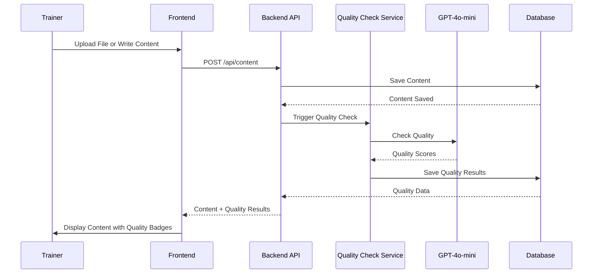

### Feature: B3. Template Management

**User Journey Flow:**

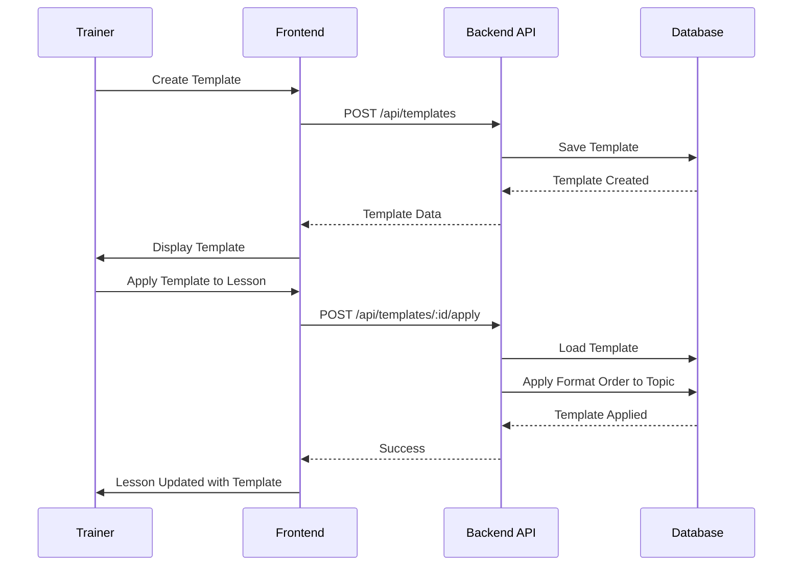

### Feature: B4. Content Versioning & History

**User Journey Flow:**

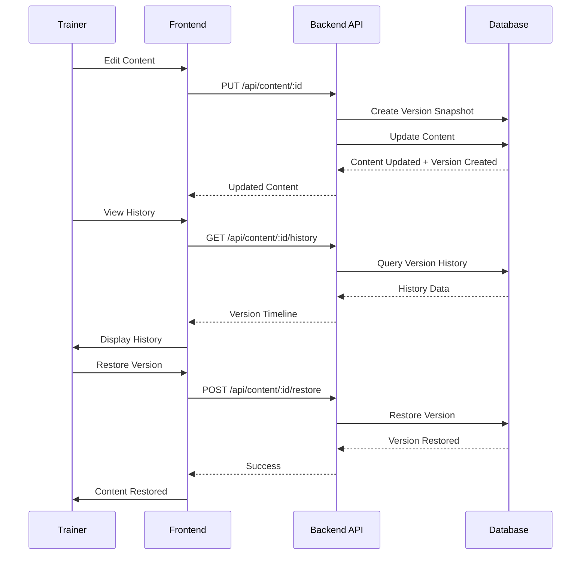

### Feature: C2. Content Search & Filtering

**User Journey Flow:**

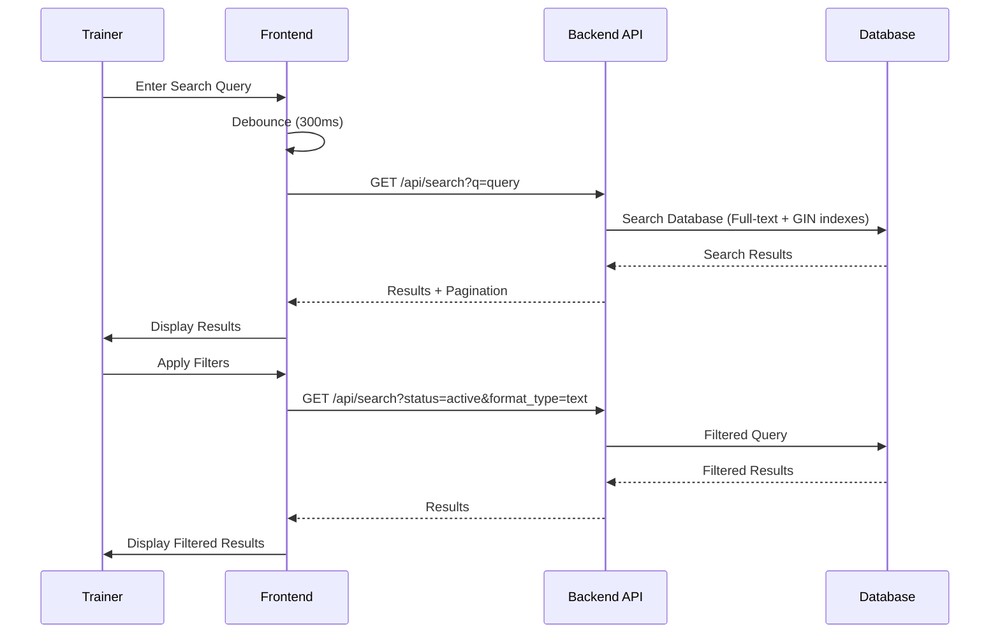

### Feature: D1. Microservice Integration

**Complete Integration Flow:**

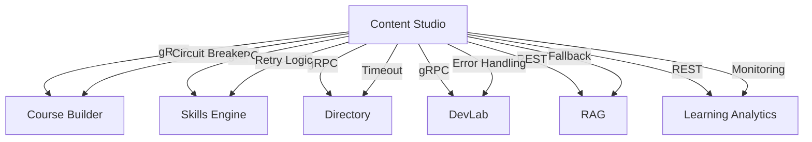

### Feature: D2. Notification System

**User Journey Flow:**

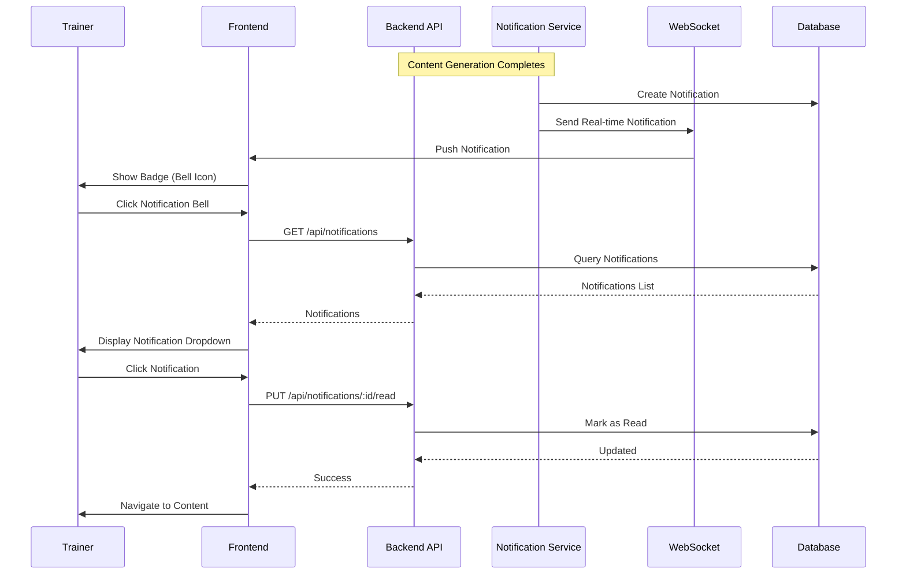

---

## Per-Feature Technical Specifications

### Feature: A1. Video-to-Lesson Transformation

**Technical Constraints:**
- Video file size: Maximum 500MB
- Video formats: MP4, MOV, AVI, WebM
- Processing time: Under 5 minutes for 10-minute video
- Concurrent processing: Queue-based, supports multiple videos

**Security Specifications:**
- File upload validation (type, size)
- Authentication required
- Video files stored in secure Supabase Storage bucket
- Access control: Trainer owns the video

**Reliability Specifications:**
- Queue job persistence (Redis)
- Retry logic for transcription failures (max 3 retries)
- Partial completion handling (save successful formats)
- Error recovery: Manual retry option

**Integration Specifications:**
- Whisper API: OpenAI Speech API
- GPT-4o-mini: OpenAI Chat API
- Google Slides API: OAuth 2.0
- Gemini API: REST API
- Supabase Storage: REST API

**Deployment Specifications:**
- Queue workers: Separate processes/containers
- Scaling: Horizontal scaling of queue workers
- Monitoring: Queue job metrics, processing time

**Testing Specifications:**
- Unit tests: Video upload service, transcription service
- Integration tests: Complete pipeline with mocked APIs
- E2E tests: Full video-to-lesson flow
- Performance tests: Large video files, concurrent processing

**Monitoring Specifications:**
- Metrics: Upload success rate, transcription accuracy, format generation success rate
- Logging: All API calls, errors, processing times
- Alerting: Processing failures, queue backlog

---

### Feature: A2. AI-Assisted Content Creation

**Technical Constraints:**
- Input length: Topic 3-200 chars, Key ideas 10-2000 chars
- Generation time: Under 60 seconds
- Format selection: At least 1 format required
- Concurrent generation: Parallel format generation

**Security Specifications:**
- Input validation and sanitization
- API key security (environment variables)
- Rate limiting: 10 requests/minute per trainer

**Reliability Specifications:**
- Retry logic for AI API failures
- Fallback to manual creation if AI fails
- Partial generation (save successful formats)

**Integration Specifications:**
- OpenAI GPT-4o-mini: Chat API
- Gemini API: REST API
- Google Slides API: OAuth 2.0

**Deployment Specifications:**
- Async generation via queue (optional)
- Real-time generation for small content

**Testing Specifications:**
- Unit tests: Prompt template service, AI generation service
- Integration tests: AI API calls with mocked responses
- E2E tests: Complete generation flow

---

### Feature: B1. Course Management

**Technical Constraints:**
- Course name: 3-255 characters
- Description: Maximum 2000 characters
- Skills: Array of strings (TEXT[])
- List query: Pagination required (max 50 per page)

**Security Specifications:**
- Authentication required
- Authorization: Trainer can only access own courses
- Input validation: All fields validated

**Reliability Specifications:**
- Soft delete: Status update, no physical delete
- Transaction management: Course creation is atomic
- Integration failure: Course still created, integration retried

**Integration Specifications:**
- Directory Service: gRPC (async update after course creation)

**Deployment Specifications:**
- Standard CRUD operations
- No special deployment requirements

**Testing Specifications:**
- Unit tests: Course service, validation
- Integration tests: Directory service integration
- E2E tests: Course creation, editing, deletion

---

### Feature: B2. Lesson/Topic Management

**Technical Constraints:**
- Topic name: 3-255 characters
- Format requirement: Minimum 5 mandatory formats
- Skills: Fetched from Skills Engine, stored as TEXT[]
- Usage count: Integer, updated when used by Course Builder

**Security Specifications:**
- Authentication required
- Authorization: Trainer owns the topic
- Format validation: Enforced at API level

**Reliability Specifications:**
- Format requirement validation before saving
- Skills Engine integration: Fallback if service unavailable
- Stand-alone lesson support: course_id nullable

**Integration Specifications:**
- Skills Engine: gRPC (synchronous, required for topic creation)
- Course Builder: gRPC (usage_count returned)

**Deployment Specifications:**
- Format validation logic
- Skills Engine dependency

**Testing Specifications:**
- Unit tests: Topic service, format validation
- Integration tests: Skills Engine integration
- E2E tests: Topic creation with format validation

---

### Feature: B3. Template Management

**Technical Constraints:**
- Template name: 3-255 characters
- Format order: JSONB array
- Prompt template: TEXT field (unlimited length)
- Template application: Atomic operation

**Security Specifications:**
- Authentication required
- Authorization: Trainer owns the template
- Template validation: Format order must be valid

**Reliability Specifications:**
- Template application: Transaction-based
- Format order validation: Must match content_types

**Integration Specifications:**
- No external integrations
- Used internally by AI-Assisted Creation (A2)

**Deployment Specifications:**
- Standard CRUD operations
- Template application logic

**Testing Specifications:**
- Unit tests: Template service, format order validation
- Integration tests: Template application
- E2E tests: Template creation and application

---

### Feature: B4. Content Versioning & History

**Technical Constraints:**
- Version creation: Automatic on content update
- History storage: Immutable (append-only)
- Version restoration: Creates new version, preserves history
- History query: Efficient with indexes

**Security Specifications:**
- Authentication required
- Authorization: Trainer can only view own content history
- Audit trail: Complete and immutable

**Reliability Specifications:**
- Version creation: Atomic with content update
- History preservation: Never deleted
- Restoration: Transaction-based

**Integration Specifications:**
- No external integrations
- Internal version management

**Deployment Specifications:**
- Database indexes for history queries
- Version creation triggers (optional)

**Testing Specifications:**
- Unit tests: Version service, restoration logic
- Integration tests: Version creation and history
- E2E tests: Version restoration flow

---

### Feature: C1. Quality & Originality Checks

**Technical Constraints:**
- Check time: Under 30 seconds
- Score accuracy: Within 10% of manual assessment
- Plagiarism detection: 90%+ accuracy
- Automatic trigger: On manual content save

**Security Specifications:**
- Content validation before check
- API key security (OpenAI)
- Results stored securely

**Reliability Specifications:**
- Retry logic for API failures
- Fallback: Manual review option
- Partial results: Store even if check incomplete

**Integration Specifications:**
- OpenAI GPT-4o-mini: Chat API for quality analysis

**Deployment Specifications:**
- Async quality checks via queue
- Real-time for small content (optional)

**Testing Specifications:**
- Unit tests: Quality check service, score calculation
- Integration tests: OpenAI API integration
- E2E tests: Quality check flow

---

### Feature: C2. Content Search & Filtering

**Technical Constraints:**
- Search response time: Under 500ms
- Filtering: Multiple filters supported (AND logic)
- Pagination: 10, 25, 50 results per page
- Debouncing: 300ms delay for search input

**Security Specifications:**
- Authentication required
- Authorization: Search only own content
- Input sanitization: Search query sanitized

**Reliability Specifications:**
- Database indexes for performance (GIN, B-tree)
- Query optimization: Efficient full-text search
- Fallback: Empty results if search fails

**Integration Specifications:**
- No external integrations
- Database queries only

**Deployment Specifications:**
- Database indexes required
- Query optimization

**Testing Specifications:**
- Unit tests: Search service, filter logic
- Integration tests: Database queries
- E2E tests: Search and filter flow

---

### Feature: D1. Microservice Integration

**Technical Constraints:**
- Timeout: 30 seconds maximum
- Retry: 3 attempts with exponential backoff
- Circuit breaker: Open after 5 failures
- Health check: Every 30 seconds

**Security Specifications:**
- gRPC: TLS encryption
- REST: HTTPS
- Authentication: Service-to-service auth
- API keys: Secure storage

**Reliability Specifications:**
- Circuit breaker pattern
- Retry logic with exponential backoff
- Graceful degradation on failures
- Health monitoring

**Integration Specifications:**
- gRPC: Protocol Buffers
- REST: JSON
- Error handling: Standardized error format

**Deployment Specifications:**
- Service discovery
- Load balancing
- Health checks

**Testing Specifications:**
- Unit tests: Integration clients, error handling
- Integration tests: Mock microservices
- E2E tests: Complete integration flows

---

### Feature: D2. Notification System

**Technical Constraints:**
- Notification delivery: Under 1 second (in-app)
- Email delivery: Under 5 minutes
- Notification limit: 1000 per trainer
- Real-time: WebSocket connection

**Security Specifications:**
- Authentication required
- Authorization: Trainer can only see own notifications
- Email: Secure delivery

**Reliability Specifications:**
- Notification persistence (optional database table or in-memory)
- Delivery retry for email
- WebSocket reconnection logic

**Integration Specifications:**
- Email service: SMTP or email API
- WebSocket: Real-time connection
- Future: Directory service for centralized notifications

**Deployment Specifications:**
- WebSocket server
- Email service integration
- Notification queue (optional)

**Testing Specifications:**
- Unit tests: Notification service
- Integration tests: Email delivery, WebSocket
- E2E tests: Notification flow

---

## Validation Gates

### Phase 4 Completion Checklist

- [x] Architectural pattern selected and approved (Onion Architecture)
- [x] System architecture documented and validated
- [x] Security requirements implemented and documented
- [x] Performance requirements met in design
- [x] AI components safely integrated
- [x] All interfaces defined and documented
- [x] System flows fully documented (all features)
- [x] Technical specifications documented and validated (all features)
- [x] Architecture documentation complete
- [x] All per-feature architectural components defined
- [x] Cross-feature dependencies documented
- [x] API requirements documented for all features
- [x] AI/prompt requirements documented for all features

**Phase 4 Status:** ✅ COMPLETE

---

## Summary

**Phase 4: Design & Architecture - COMPLETE**

**Key Deliverables:**
- Onion Architecture (Clean Architecture) approved and documented
- Complete API specifications for all 11 MVP features
- AI prompt specifications for all AI-powered features
- System flow diagrams (Mermaid) for all features
- Technical specifications per feature
- Security, reliability, and integration architectures
- Error handling and recovery mechanisms

**Next Steps:**
- Proceed to Phase 5: UI/UX Design
- Create design system and component library
- Design wireframes and prototypes
- Implement accessibility and responsive design

---

**Document Version:** 1.0 (Complete)  
**Last Updated:** 2025-01-04

